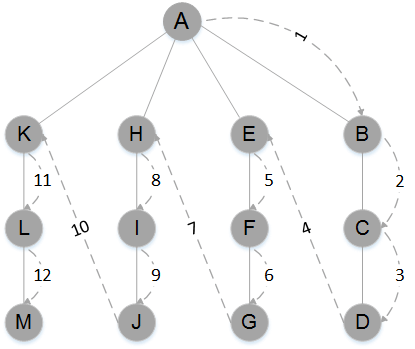
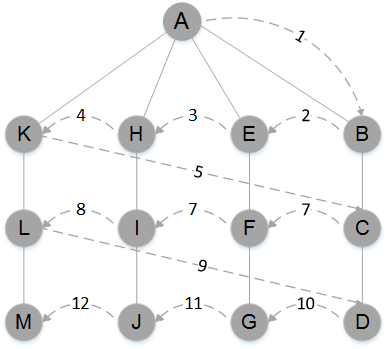

<a name="graph"></a>
##图 - Graph
图是由 *边* 的集合及 *顶点* 的集合组成。边由顶点对(v1,v2)定义，v1和v2分别是图中的两个顶点。顶点也有权重(成本)。如果一个图的顶点对是有序的则称为 *有向图* ，否则称为 *无序图* 。
图中的一系列顶点构成 *路径* ，路径中所有的顶点都由边连接。路径的长度用路径中第一个顶点到最后一个顶点之间边的数量表示。由指向自身的顶点组成的路径称为 *环* 。环的长度为0。  
如果两个顶点之间有路径，那么这两个顶点就是强连通的，反之亦然。  

###构造图类
用节点来表示每个顶点。注意图可能增长到非常大，因此用基于对象的方式去处理就会有问题。  

表示顶点  
创建图类的第一步就是要创建一个Vertex类来保存顶点和边。这个类的作用与链表和二叉搜索树的Node类一样。Vertex类有两个数据成员：一个用于标识顶点(*label*)，另一个是表明这个顶点是否被访问过的布尔值(*wasVisited*)。构造函数的代码如下：  
```javascript
var Vertex = function (label, wasVisited){
	this.label = label;
	this.wasVisited = wasVisited;
}
```
我们将所有顶点保存到数组中，在图类里可以通过它们在数组中的位置引用它们。  

表示边  
图的结构比较灵活，一个顶点可以有一条边也可以有多条边与它相邻。所以用*邻接表(邻接表数组)*表示图的边。这种方法将边存储为由顶点的相邻顶点列表构成的数组，并以此顶点作为索引。  
比如顶点2与顶点0、1、3、4相连，并且它存储在数组中索引为2的位置，那么访问这个元素我们可以访问到索引为2的位置处由顶点0、1、3、4组成的数组。
```javascript
0 -> 2
1 -> 2
2 -> 0 1 3 4
3 -> 2
4 -> 2
```
另一种表示图边的方法是*邻接矩阵*。它是一个二维数组，其中的元素表示两个顶点之间是否有一条边。  

####构建图
构建一个表示图的类的代码如下:  
```javascript
/*
 * Graph() - 表示图类
 * 记录一个图表示了多少条边，并使用一个长度与图的顶点数相同的数组来记录顶点的数量
 * 通过for循环为数组中的每个元素添加一个子数组来存储所有的相邻顶点，并将所有元素初始化为空字符串
 */
var Graph = function (v){
	this.vertices = v;
	this.edges = 0;
	this.adj = [];
	for (var i = 0; i < this.vertices; i++){
		this.adj[i] = [];
		this.adj[i].push(" ");
	}
	this.addEdge = addEdge;
	this.showGraph = showGraph;
}
/*
 * addEdge() - 添加边
 * 传入顶点A和B时，先查找顶点A的邻接表，将顶点B添加到列表中
 * 然后再查找顶点B的邻接表，将顶点A加入列表。最近将边的数量加1
 */
var addEdge = function (v, w){
	this.adj[v].push(w);
	this.adj[w].push(v);
	this.edges++;
}
//	显示
var showGraph = function (){
	for (var i = 0; i < this.vertices; i++){
		console.log(i + " -> ");
		for (var j = 0; j < this.vertices; j++){
			if (this.adj[i][j] != undefined){
				console.log(this.adj[i][j] + "  ");
			}
		}
		console.log();
	}
}

//demo
var g = new Graph(5);
g.addEdge(0,1);
g.addEdge(0,2);
g.addEdge(1,3);
g.addEdge(2,4);
g.showGraph();
```

###图的相关搜索
对图的搜索，在此讨论两种基础算法： *深度优先搜索* 和 *广度优先搜索* 。  

####深度优先搜索
从一条路径的起始顶点开始追溯，直到到达最后一个顶点，然后回溯，继续追溯下一条路径，直到到达最后的顶点，如此往复直到没有路径为止。  
  
图：深度优先搜索  
深度优先搜索算法思想如下：  
访问一个没有访问过的顶点，将它标记为已访问，再递归地去访问在初始顶点的邻接表中其他没有访问过的顶点。  
实现：需要在Graph类添加一个数组用来存储已访问过的顶点，将它所有元素的值全部初始化为false。如下
```javascript
//在Graph()里加入以下代码
this.marker = [];
for (var i = 0; i < this.vertices; i++){
	this.marker[i] = false;
}

var Graph = function (v){
	this.vertices = v;
	this.edges = 0;
	this.adj = [];
	for (var i = 0; i < this.vertices; i++){
		this.adj[i] = [];
		this.adj[i].push(" ");
	}
	this.addEdge = addEdge;
	this.showGraph = showGraph;
	this.marker = [];
	for (var i = 0; i < this.vertices; i++){
		this.marker[i] = false;
	}
}
```
实现代码
```javascript
var dfs = function (v){
	this.marker[v] = true;
	//用于输出的if语句在这里不是必须的
	if (this.adj[v] != undefined)
		console.log("Visited vertex: " +v);
	for each (var w in this.adj[v]){
		if (!this.marker[w]){
			this.dfs(w);
		}
	}
}
```

####广度优先搜索
从第一个顶点开始，尝试访问尽可能靠近它的顶点。其实就是在图上逐层移动。  
首先检查最靠近第一个顶点的层，再逐渐向下移动到离起始顶点最远的层。
  
图：广度优先搜索  
其算法使用了抽象的队列而不是数组来对已访问过的顶点进行排序。其原理如下:  
1.查找与当前顶点相邻的未访问顶点，将其添加到已访问顶点列表及队列中
2.从图中取出下一个顶点v，添加到已访问的顶点列表
3.将所有与v相邻的未访问顶点添加到队列  
代码实现
```javascript
var bfs = function (s){
	var queue = [];
	this.marker[s] = true;
	queue.push(s);	//添加到队尾
	while (queue.length > 0){
		var v = queue.shift();	//从队首移除
		if (typeof(v) == "undefined"){
			console.log("Visisted vertex: " + v);
		}
		for each (var w in this.adj[v]){
			if (!this.marker[w]){
				this.edgeTo[w] = v;
				this.marker[w] = true;
				queue.push(w);
			}
		}
	}
}

//demo
var g = new Graph(5);
g.addEdge(0,1);
g.addEdge(0,2);
g.addEdge(1,3);
g.addEdge(2,4);
g.showGraph();
g.bfs(0);
```

###查找最短路径
要查找最短路径，需要修改广度优先搜索算法来记录从一个顶点到另一个顶点的路径。  
首先需要一个数组来保存从一个顶点到下一个顶点的所有边(命名为edgeTo)。每次都会遇到一个没有标记的顶点，除了对它进行标记外，还会从邻接列表中正在搜索的顶点添加一条边到这个顶点。  
相应代码如下：
```javascript
var Graph = function (v){
	this.vertices = v;
	this.edges = 0;
	this.adj = [];
	for (var i = 0; i < this.vertices; i++){
		this.adj[i] = [];
		this.adj[i].push(" ");
	}
	this.addEdge = addEdge;
	this.showGraph = showGraph;
	this.marker = [];
	for (var i = 0; i < this.vertices; i++){
		this.marker[i] = false;
	}
	this.edgeTo = [];
	this.pathTo = pathTo;
	this.hasPathTo = hasPathTo;
}
var bfs = function (s){
	var queue = [];
	this.marker[s] = true;
	queue.push(s);	//添加到队尾
	while (queue.length > 0){
		var v = queue.shift();	//从队首移除
		if (typeof(v) == "undefined"){
			console.log("Visisted vertex: " + v);
		}
		for each (var w in this.adj[v]){
			if (!this.marker[w]){
				this.edgeTo[w] = v;
				this.marker[w] = true;
				queue.push(w);
			}
		}
	}
}
//pathTo() - 用于展示图中连接到不同顶点的路径
var pathTo = function (v){
	var source = 0;
	if (!this.hasPathTo(v)){
		return undefined;
	}
	var path = [];
	for (var i = v; i != source; i = this.edgeTo[i]){
		path.push(i)
	}
	//path.push(s);
	return path;
}
var hasPathTo = function (v){
	return this.marker[v];
}

//demo
var g = new Graph(5);
g.addEdge(0,1);
g.addEdge(0,2);
g.addEdge(1,3);
g.addEdge(2,4);
var vertex = 4;
var paths = g.pathTo(vertex);
while (paths.length > 0){
	if (paths.length > 1){
		console.log(paths.pop() + '-');
	}else{
		console.log(paths.pop());
	}
}
//输出 0-2-4
```

####拓扑排序
拓扑排序会对有向图的所有顶点进行排序，使有向边从前面的顶点指向后面的顶点。  
拓扑排序算法与深度优先搜索类似。不同之处是拓扑排序算法不会立即输出已访问的顶点，而是访问当前顶点邻接表中的所有相邻顶点，直到这个列表穷尽时才将当前顶点压入栈中。  
算法分为两个函数实现：topSort()和topSortHelper().  
递归函数topSortHelper()，这个函数会将当前顶点标记为已访问，然后递归访问当前顶点邻接表中的每个相邻顶点，标记这些顶点为已访问。最后将当前顶点压入栈。
```javascript
var topSort = function (){
	var stack = [];
	var visited = [];
	for (var i = 0; i < this.vertices; i++){
		visited[i] = false;
	}
	for (var i = 0; i < this.vertices; i++){
		if (visited[i] === false){
			this.topSortHelper(i, visited, stack);
		}
	}
	for (var i = 0, l = stack.length; i < l; i++){
		if (stack[i] != undefined && stack[i] != false){
			console.log(this.vertexList[stack[i]]);
		}
	}
}

var topSortHelper = function (v, visited, stack){
	visited[v] = true;
	this.adj[v].forEach(function (w){
		if (!visited[w]){
			this.topSortHelper(visited[w], visited, stack);
		}
	})
	stack.push(v);
}
```


